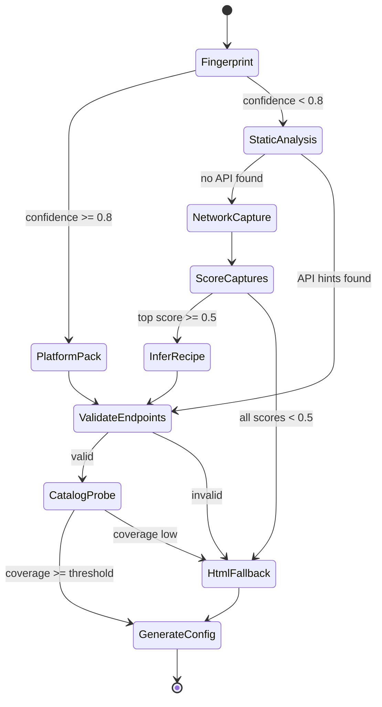

# Agent Architecture

## Not a Chat Agent

Discovery uses a **deterministic orchestrator** with **bounded AI tools** at specific decision points. There is no LLM loop, no tool-calling agent, and no chat interface.

The orchestrator is TypeScript code (`discoverOrchestrator()`), not an autonomous agent. It calls tools, scores results, and branches based on thresholds.

## State Machine



## Orchestrator vs Tools

| Component | Implementation | AI? |
|-----------|----------------|-----|
| Orchestrator | `apps/worker/src/consumers/discover-orchestrator.ts` | No |
| Tools | `packages/crawler/src/discover/stages/*.ts` | Mostly no |
| AI tools | `infer-api-recipe.ts`, `category-directory.ts` | Yes |

## AI Invocation Gates

LLM is invoked only when deterministic paths fail:

```typescript
// Pseudocode — packages/crawler/src/discover/orchestrator.ts

async function selectRecipe(ctx: DiscoveryContext): Promise<CrawlRecipe> {
  // 0 tokens — try platform pack first
  const packRecipe = await runPlatformPack(ctx.fingerprint);
  if (packRecipe && (await validateEndpoint(packRecipe)).confidence >= 0.7) {
    return generateCrawlRecipe(ctx, packRecipe);
  }

  // 0 tokens — parallel static analysis may have found API hints
  const staticCandidates = ctx.staticAnalysis.apiCandidates;
  for (const candidate of staticCandidates) {
    const validation = await validateEndpoint(candidate);
    if (validation.confidence >= 0.7) {
      return generateCrawlRecipe(ctx, candidate);
    }
  }

  // Network capture + scoring (0 tokens for scoring)
  const captures = await captureNetwork(ctx);
  const ranked = rankCaptures(captures);
  const top = ranked[0];

  if (top && top.score >= 0.7) {
    // Deterministic replay already works — no AI needed
    return generateCrawlRecipe(ctx, top.recipe);
  }

  if (top && top.score >= 0.5) {
    // AI-assisted field-map inference only
    const inferred = await inferApiRecipeFromCaptures([top.capture]);
    const validation = await validateEndpoint(inferred);
    if (validation.confidence >= 0.7) {
      return generateCrawlRecipe(ctx, inferred);
    }
  }

  // Jina for navigation only (AI for category tree if heuristics fail)
  if (ctx.fingerprint.botProtection !== 'none') {
    const jinaResult = await discoverCategoryDirectory(ctx);
    if (jinaResult.directory.confidence >= 0.3) {
      return mergeJinaIntoCrawlRecipe(ctx.baseRecipe, jinaResult.directory);
    }
  }

  // HTML/sitemap fallback — no LLM for discovery
  return generateCrawlRecipe(ctx, ctx.staticAnalysis.sitemapFallback);
}
```

## Checkpointing

Each stage writes progress to `discovery_runs`:

```typescript
interface DiscoveryCheckpoint {
  discoveryRunId: string;
  stage: string;
  status: 'running' | 'completed' | 'failed' | 'skipped';
  outputArtifactUrl?: string;  // Vercel Blob
  tokenUsage: number;
  completedAt?: Date;
}
```

Enables resume after worker crash without restarting from Stage 0.

## Refactor Target

Replace linear if/else in `apps/worker/src/consumers/discover-config.ts`:

```typescript
async function runDiscovery(onboardingId: string) {
  const ctx = await initContext(onboardingId);

  ctx.fingerprint = await fingerprintSite(ctx);
  await checkpoint(ctx, 'fingerprint');

  const [platformCandidates, staticAnalysis] = await Promise.all([
    runPlatformPack(ctx),
    runStaticAnalysis(ctx),
  ]);

  let captures: CapturedRequest[] = [];
  if (!hasValidCandidate(platformCandidates, staticAnalysis)) {
    captures = await captureNetwork(ctx);
    await checkpoint(ctx, 'network', { artifactUrl: ctx.harUrl });
  }

  const validated = await validateEndpoints([
    ...platformCandidates,
    ...staticAnalysis.apiCandidates,
    ...rankCaptures(captures),
  ]);

  const recipe = await generateCrawlRecipe(ctx, validated);
  await persistRecipe(recipe);
  await writeKnowledgeDocs(ctx);
  await promoteRetailer(ctx);
}
```

## LLM Calls (Only Two)

1. **`inferFieldMap`** — Given validated JSON response schema + 3 sample products → `ApiRecipe.fieldMap`
2. **`inferCategoryTree`** — Given Jina/nav markdown when heuristics find <3 categories → `CategoryDirectory`

All other stages are deterministic. See [AI-STRATEGY.md](./AI-STRATEGY.md) for full policy.
