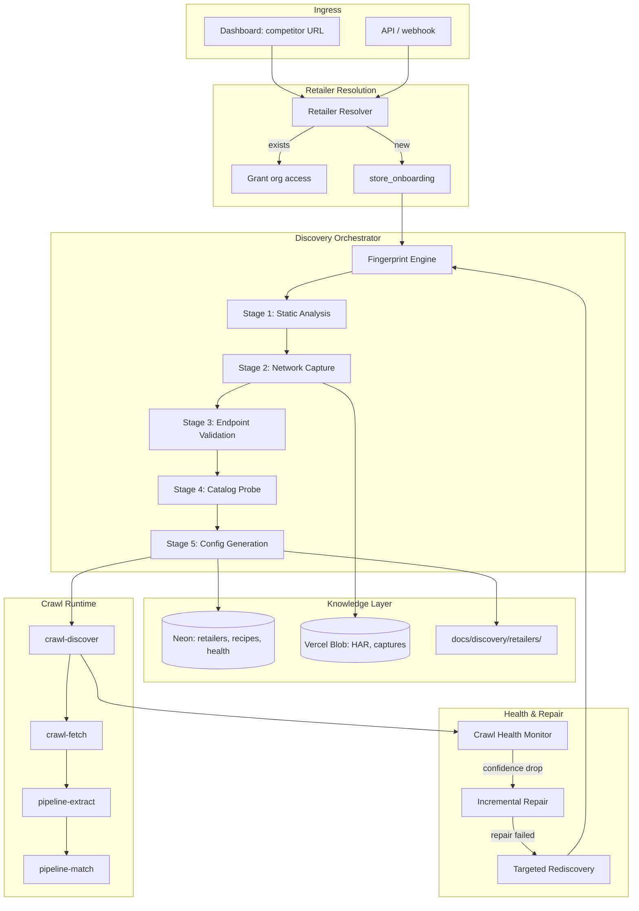
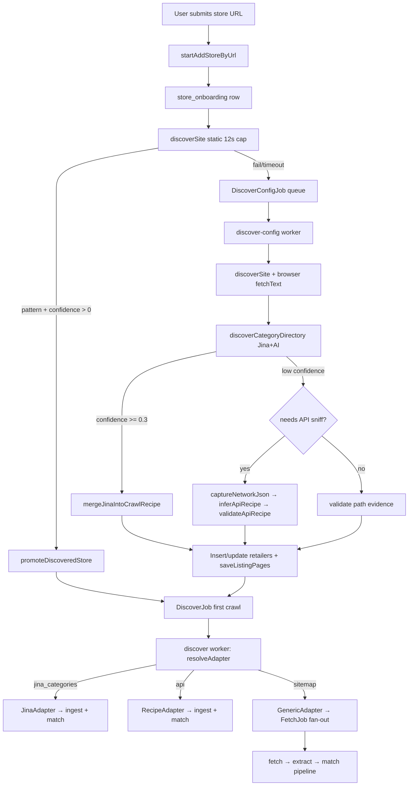

# System Architecture

## Overview

RetAIler discovery spans two phases:

1. **Onboarding / config discovery** — Determine how to extract a retailer's full catalog.
2. **Crawl discovery** — Enumerate products on each scheduled or on-demand run.

Config is persisted on `retailers.crawlRecipe` plus optional `retailer_listing_pages` rows. Crawl runs are tracked in `crawl_runs`.

## High-Level Diagram



## Package Placement

| Module | Package | Role |
|--------|---------|------|
| `fingerprint/` | `packages/crawler` | Platform detection, bundle analysis, strategy routing |
| `discover/stages/` | `packages/crawler` | Deterministic stage implementations |
| `discover/platform-packs/` | `packages/crawler` | Shopify, SFCC, Magento, etc. known endpoints |
| `discover/repair/` | `packages/crawler` | Incremental config repair |
| `discover/knowledge/` | `packages/crawler` | Read/write retailer intelligence docs |
| `RetailerFingerprintSchema` | `packages/schema` | Typed fingerprint + health |
| `discover-orchestrator` consumer | `apps/worker` | Multi-stage job coordinator |
| `crawl-health` consumer | `apps/worker` | Post-crawl health evaluation |
| `discover-repair` consumer | `apps/worker` | Incremental repair attempts |

## Retailer Resolution (B2B Entry Point)

When a business submits a homepage URL:

```
normalizeUrl(input) → domain
  → lookup retailers WHERE domain = ? OR homepage_url = ?
    → HIT: link org_competitors, return existing retailer (immediate access)
    → MISS: create store_onboarding → enqueue DiscoverOrchestratorJob
```

### If competitor exists

- Reuse existing `retailers` row and `crawlRecipe`
- Reuse existing catalog data in `retailer_products`
- Grant org access via `org_competitors`
- No rediscovery unless health score is below threshold

### If competitor does not exist

- Run full discovery orchestrator
- Build reusable crawl configuration
- Populate retailer catalog via first `crawl-discover` job
- Schedule recurring refreshes via existing scheduler

**Implementation note:** Domain-level dedup and shared-retailer model need to be added. Today `store_onboarding` is per-org; one discovery should serve all orgs monitoring the same domain.

## Current Pipeline (Baseline)



The target architecture **evolves** this pipeline into a parallel orchestrator with health/repair loops — not a greenfield rewrite.

## Crawl Runtime (Unchanged Core)

`crawl-discover` resolves adapter from `crawlRecipe.discoveryMode`:

| Mode | Adapter | Flow |
|------|---------|------|
| `api` | `createRecipeAdapter` | Paginated API → direct ingest |
| `jina_categories` | `createJinaAdapter` | Paginated Jina listing pages → direct ingest |
| `sitemap` | `createGenericAdapter` or hand-written | URL discovery → `crawl-fetch` → extract → match |
| `listing_pages` | **Not implemented** | Schema exists; needs adapter |

## Tech Stack Integration

| Layer | Technology |
|-------|------------|
| Frontend | Next.js 15, React 19 (dashboard onboarding UI) |
| Workers | BullMQ, Fly.io workers |
| Database | Neon Postgres, Drizzle ORM |
| Cache/queues | Upstash Redis |
| Artifacts | Vercel Blob (HAR, bundles, probes) |
| Browser | Playwright (network capture, bot-protected sites) |
| AI | Vercel AI SDK via AI Gateway (`@retailer/core`) |
| Fetch proxy | Jina Reader (navigation/markdown only) |
