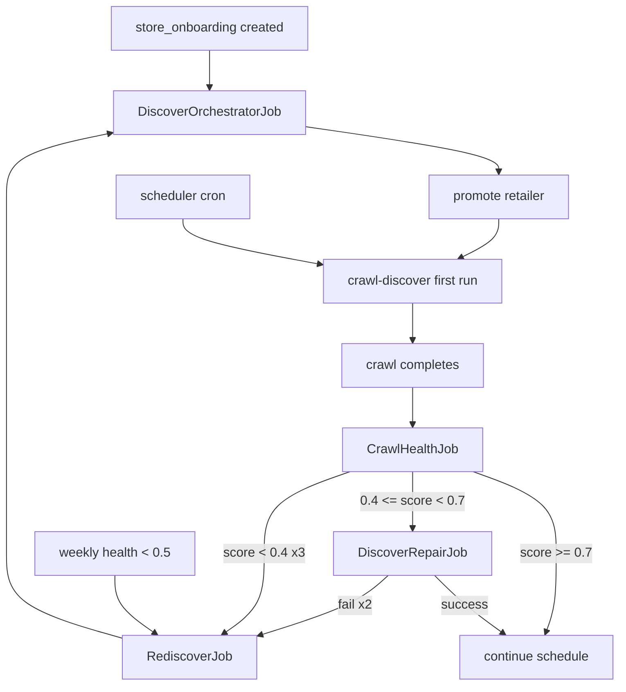

# BullMQ Job Design

Extends existing queue architecture in `packages/jobs/src/queues.ts` and `packages/schema/src/jobs.ts`.

## Current Discovery Queues (Baseline)

| Queue (Redis) | Job type | Consumer |
|---------------|----------|----------|
| `store-discover-config` | `DiscoverConfigJob` | `discover-config.ts` |
| `crawl-discover` | `DiscoverJob` | `discover.ts` |

Downstream (sitemap path):

| Queue | Job | Consumer |
|-------|-----|----------|
| `crawl-fetch` | `FetchJob` | `fetch.ts` |
| `pipeline-extract` | `ExtractJob` | `extract.ts` |
| `pipeline-match` | `MatchJob` | `match.ts` |

---

## New Queues

| Queue | Job | Concurrency | Timeout | Notes |
|-------|-----|-------------|---------|-------|
| `store-discover-orchestrator` | `DiscoverOrchestratorJob` | 2–4 | 10 min | Replaces/extends `store-discover-config` |
| `store-discover-stage` | `DiscoverStageJob` | varies | per stage | Optional fan-out for parallelism |
| `crawl-health` | `CrawlHealthJob` | 4 | 2 min | Post-crawl health evaluation |
| `store-discover-repair` | `DiscoverRepairJob` | 2 | 5 min | Incremental repair |
| `store-rediscover` | `RediscoverJob` | 1 | 15 min | Full rediscovery (rare) |

---

## Job Schemas

Add to `packages/schema/src/jobs.ts`:

```typescript
import { z } from 'zod';

export const DiscoverOrchestratorJobSchema = z.object({
  onboardingId: z.string().uuid().optional(),
  retailerKey: z.string().optional(),
  mode: z.enum(['onboard', 'rediscover', 'repair']).default('onboard'),
  repairHint: z.string().optional(),
  /** Force specific stages to re-run (e.g. after manual fix) */
  forceStages: z
    .array(
      z.enum(['fingerprint', 'static', 'network', 'validate', 'probe', 'generate']),
    )
    .optional(),
});

export type DiscoverOrchestratorJob = z.infer<typeof DiscoverOrchestratorJobSchema>;

export const DiscoverStageJobSchema = z.object({
  discoveryRunId: z.string().uuid(),
  stage: z.enum(['fingerprint', 'static', 'network', 'validate', 'probe', 'generate']),
  inputArtifactUrl: z.string().url().optional(),
});

export type DiscoverStageJob = z.infer<typeof DiscoverStageJobSchema>;

export const CrawlHealthJobSchema = z.object({
  retailerKey: z.string(),
  crawlRunId: z.string().uuid(),
});

export type CrawlHealthJob = z.infer<typeof CrawlHealthJobSchema>;

export const DiscoverRepairJobSchema = z.object({
  retailerKey: z.string(),
  trigger: z.enum(['health_drop', 'endpoint_failure', 'schema_drift', 'manual']),
  healthReportId: z.string().uuid().optional(),
});

export type DiscoverRepairJob = z.infer<typeof DiscoverRepairJobSchema>;

export const RediscoverJobSchema = z.object({
  retailerKey: z.string(),
  reason: z.string(),
  preserveEndpoints: z.boolean().default(true),
});

export type RediscoverJob = z.infer<typeof RediscoverJobSchema>;
```

Add to `QueueName` enum:

```typescript
export enum QueueName {
  // existing...
  DiscoverOrchestrator = 'store-discover-orchestrator',
  DiscoverStage = 'store-discover-stage',
  CrawlHealth = 'crawl-health',
  DiscoverRepair = 'store-discover-repair',
  Rediscover = 'store-rediscover',
}
```

---

## Queue Helpers

Add to `packages/jobs/src/queues.ts`:

```typescript
discoverOrchestrator(data: DiscoverOrchestratorJob) {
  return discoverOrchestratorQueue.add('orchestrate', data, {
    jobId: data.onboardingId ?? `rediscover:${data.retailerKey}`,
  });
},

crawlHealth(data: CrawlHealthJob) {
  return crawlHealthQueue.add('evaluate', data, {
    jobId: `health:${data.crawlRunId}`,
  });
},

discoverRepair(data: DiscoverRepairJob) {
  return discoverRepairQueue.add('repair', data);
},

rediscover(data: RediscoverJob) {
  return rediscoverQueue.add('rediscover', data, {
    jobId: `rediscover:${data.retailerKey}`,
  });
},
```

---

## Retry Policy

### Default (from existing `queues.ts`)

```typescript
attempts: 3,
backoff: { type: 'exponential', delay: 5000 },
removeOnComplete: { age: 86400, count: 5000 },
removeOnFail: { age: 604800 },
```

### Per-Queue Overrides

| Job | Attempts | Backoff | Special |
|-----|----------|---------|---------|
| `DiscoverOrchestratorJob` | 2 | 30s exponential | Do not retry on `hard_block` |
| `DiscoverStageJob` | 3 | 10s exponential | Browser crash → new browser instance |
| `CrawlHealthJob` | 3 | 5s exponential | — |
| `DiscoverRepairJob` | 3 | 60s exponential | Final failure → enqueue `RediscoverJob` |
| `RediscoverJob` | 1 | — | Manual re-queue only |
| `DiscoverJob` (existing) | 3 | 5s exponential | `lockDuration: 3_600_000` (1hr) |
| `DiscoverConfigJob` (existing) | 3 | 5s exponential | concurrency 1 |

### Hard Block Handling

```typescript
class HardBlockError extends Error {
  constructor(public readonly domain: string, public readonly reason: string) {
    super(`Hard block: ${domain} — ${reason}`);
    this.name = 'HardBlockError';
  }
}

// In orchestrator worker:
if (err instanceof HardBlockError) {
  await markRetailerBlocked(retailerId, err.reason);
  return; // do not retry
}
```

---

## Trigger Graph



---

## Existing Job Schemas (Reference)

From `packages/schema/src/jobs.ts`:

```typescript
// DiscoverConfigJob (current onboarding)
{ onboardingId: string }

// DiscoverJob (crawl enumeration)
{ retailerKey: string; categoryFilter?: string; crawlRunId: string }

// FetchJob
{ retailerKey: string; url: string; crawlRunId: string }

// ExtractJob
{ retailerKey: string; url: string; crawlRunId: string; blobUrl: string }

// MatchJob
{ retailerProductId: string }
```

---

## Concurrency Guidelines

| Worker | Concurrency | Rationale |
|--------|-------------|-----------|
| discover-orchestrator | 1–4 | Browser-bound; start at 1, scale with pool |
| discover-config (legacy) | 1 | Shared Playwright instance |
| crawl-discover | 1 | Long API crawls; `lockDuration` 1hr |
| crawl-fetch | `CRAWLER_MAX_CONCURRENCY` (default 2) | Rate limit respect |
| crawl-health | 4 | Lightweight DB writes |
| discover-repair | 2 | May need brief browser use |
| extract / match | 4 | CPU/AI bound |

---

## Scheduled Jobs (Existing + New)

From `apps/worker/src/scheduler.ts`:

| Schedule | Job | Notes |
|----------|-----|-------|
| Per-retailer cron | `DiscoverJob` | Unchanged; add jitter by retailer key hash |
| Daily 07:00 | `AnalyticsJob` | Unchanged |
| Weekly Mon 08:00 | `ReportJob` | Unchanged |
| **New** Weekly Sun 03:00 | `RediscoverJob` | Retailers with `crawl_health_score < 0.5` for 7 days |

### Stagger Formula

```typescript
const jitterSec = hashCode(retailerKey) % 3600;
// Spread crawls within 1-hour window
```
