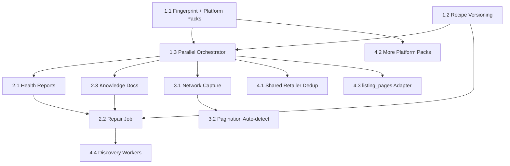

# Implementation Order

Recommended build sequence for coding agents. Each phase has clear dependencies and success criteria.

## Priority 1 — Highest ROI (Do First)

### 1.1 Fingerprint + Platform Packs (Shopify, Salesforce)

**Why:** ~40% of e-commerce sites; zero AI tokens; immediate onboarding improvement.

**Tasks:**

- [ ] Add `RetailerFingerprintSchema` to `packages/schema`
- [ ] Implement `fingerprintSite()` extending `detectPlatform()`
- [ ] Implement `platform-packs/shopify.ts`
- [ ] Implement `platform-packs/salesforce.ts`
- [ ] Wire platform pack probes into `discover-config.ts` (before Jina/API sniff)

**Success:** Shopify retailer onboarded without LLM or network capture.

**Docs:** [PLATFORM-PACKS.md](./PLATFORM-PACKS.md), [TOOLS.md](./TOOLS.md)

---

### 1.2 Recipe Versioning

**Why:** Enables rollback, repair, and audit — foundation for health monitoring.

**Tasks:**

- [ ] Migration `0005_discovery_schema.sql` — `retailer_recipe_versions`
- [ ] Add `fingerprint`, `discovery_confidence`, `crawl_health_score` to `retailers`
- [ ] Backfill script from existing `crawl_recipe`
- [ ] Write version on every promotion/repair

**Success:** Every new retailer has `retailer_recipe_versions` row v1.

**Docs:** [DATABASE-SCHEMA.md](./DATABASE-SCHEMA.md)

---

### 1.3 Parallel Discovery Stages

**Why:** Current linear fallback wastes time and misses API paths on sitemap-success sites.

**Tasks:**

- [ ] Create `discover/orchestrator.ts`
- [ ] Run platform pack + `discoverSite()` in `Promise.all`
- [ ] Select best validated candidate by confidence
- [ ] Feature flag `DISCOVERY_ORCHESTRATOR=1` in `discover-config.ts`

**Success:** Discovery time reduced for API-capable sites; same or better success rate.

**Docs:** [AGENT-ARCHITECTURE.md](./AGENT-ARCHITECTURE.md), [WORKFLOW.md](./WORKFLOW.md)

---

## Priority 2 — Reliability (Do Second)

### 2.1 Health Reports + Crawl Health Worker

**Tasks:**

- [ ] Migration — `crawl_health_reports`
- [ ] `crawl-health.ts` consumer
- [ ] Enqueue from `discover.ts` on crawl completion
- [ ] Update `retailers.crawl_health_score`

**Success:** Every crawl produces a health report row.

**Docs:** [FAILURE-RECOVERY.md](./FAILURE-RECOVERY.md)

---

### 2.2 Repair Job

**Tasks:**

- [ ] Migration — `discovery_repairs`
- [ ] `discover-repair.ts` consumer
- [ ] `repair/header-refresh.ts`
- [ ] `repair/pagination-fix.ts`
- [ ] `repair/endpoint-swap.ts`
- [ ] Trigger from health score 0.4–0.7

**Success:** Simulated header failure repaired without full rediscovery.

**Docs:** [FAILURE-RECOVERY.md](./FAILURE-RECOVERY.md), [BULLMQ-JOBS.md](./BULLMQ-JOBS.md)

---

### 2.3 Knowledge Docs

**Tasks:**

- [ ] `discover/knowledge/writer.ts`
- [ ] `discover/knowledge/reader.ts`
- [ ] Generate docs on discovery completion
- [ ] Reader invoked before repair/rediscovery

**Success:** `docs/discovery/retailers/{key}/` populated after onboarding.

**Docs:** [KNOWLEDGE-STORAGE.md](./KNOWLEDGE-STORAGE.md), [templates/](./templates/)

---

## Priority 3 — Network Depth (Do Third)

### 3.1 Extended Network Capture

**Tasks:**

- [ ] `CapturedRequest` with header deps
- [ ] HAR export to Vercel Blob
- [ ] `retailer_endpoints` table population
- [ ] GraphQL operation name parsing

**Success:** Non-platform retailer discovered with full header replay config.

**Docs:** [TOOLS.md](./TOOLS.md), [WORKFLOW.md](./WORKFLOW.md#stage-2--network-analysis)

---

### 3.2 Pagination Auto-Detection

**Tasks:**

- [ ] Extend `validate-api-recipe.ts` with page 1 vs 2 probing
- [ ] Support offset, cursor, page, link_rel
- [ ] Store detected style on `ApiRecipe.pagination`

**Success:** Inferred recipes paginate correctly without manual tuning.

---

## Priority 4 — Scale (Do Fourth)

### 4.1 Shared Retailer Dedup

**Tasks:**

- [ ] Domain normalization on URL submit
- [ ] Lookup existing `retailers` by domain before `store_onboarding`
- [ ] Link `org_competitors` on hit

**Success:** Second org adding same competitor gets instant access.

---

### 4.2 Additional Platform Packs

**Tasks:**

- [ ] Magento 2
- [ ] BigCommerce
- [ ] WooCommerce
- [ ] Commercetools
- [ ] Shopify Hydrogen

**Docs:** [PLATFORM-PACKS.md](./PLATFORM-PACKS.md)

---

### 4.3 `listing_pages` Runtime Adapter

**Tasks:**

- [ ] Implement adapter for `discoveryMode: 'listing_pages'`
- [ ] Wire in `resolveAdapter()`
- [ ] Use `retailer_listing_pages` with non-Jina fetch

**Success:** Agent manifest listing patterns work without Jina.

---

### 4.4 Dedicated Discovery Workers

**Tasks:**

- [ ] Fly.io process group `discovery`
- [ ] Worker flag `--workers=discovery`
- [ ] Browser pool (2–4 instances)

**Docs:** [SCALING.md](./SCALING.md), [WORKER-PLAN.md](./WORKER-PLAN.md)

---

## Priority 5 — Polish

- [ ] Dashboard discovery progress UI
- [ ] Ops rollback UI for recipe versions
- [ ] Weekly rediscovery scheduler for unhealthy retailers
- [ ] Endpoint pattern library
- [ ] Cost dashboard from `discovery_runs.token_usage`

---

## Dependency Graph

---

## What Not to Build Yet

- Full agentic LLM orchestrator loop
- Real-time discovery streaming to dashboard
- Multi-region proxy rotation
- Automatic ToS/compliance analysis
- Consumer-facing discovery (B2C search indexing)

These add complexity without improving the core B2B onboarding path.

---

## Agent Instructions

When picking up a task:

1. Read [README.md](./README.md) for context
2. Check [EXISTING-CODE-MAP.md](./EXISTING-CODE-MAP.md) for file locations
3. Follow [AI-STRATEGY.md](./AI-STRATEGY.md) — do not add LLM calls without explicit gate
4. Add tests matching existing patterns in `packages/crawler/src/discover/*.test.ts`
5. Update `docs/discovery/retailers/{key}/` templates if output format changes
6. Do not commit unless explicitly asked
